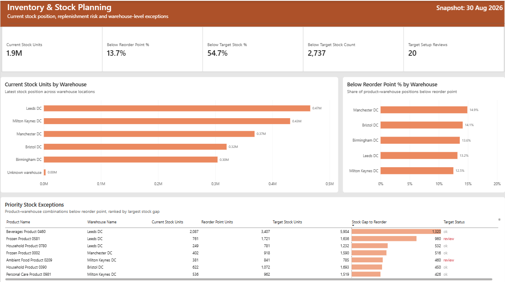
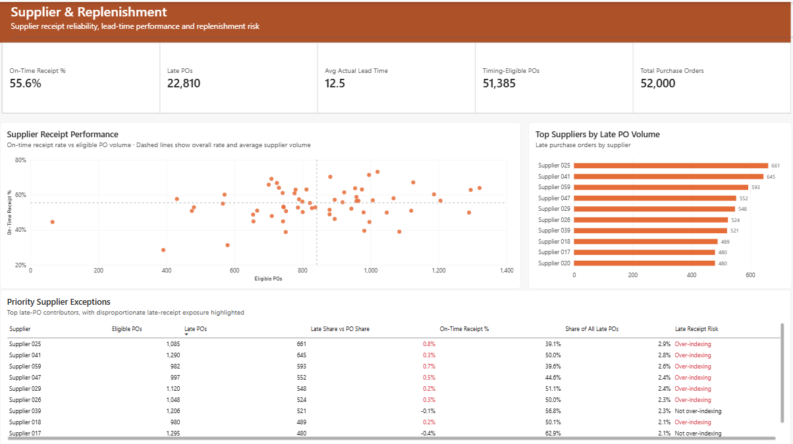
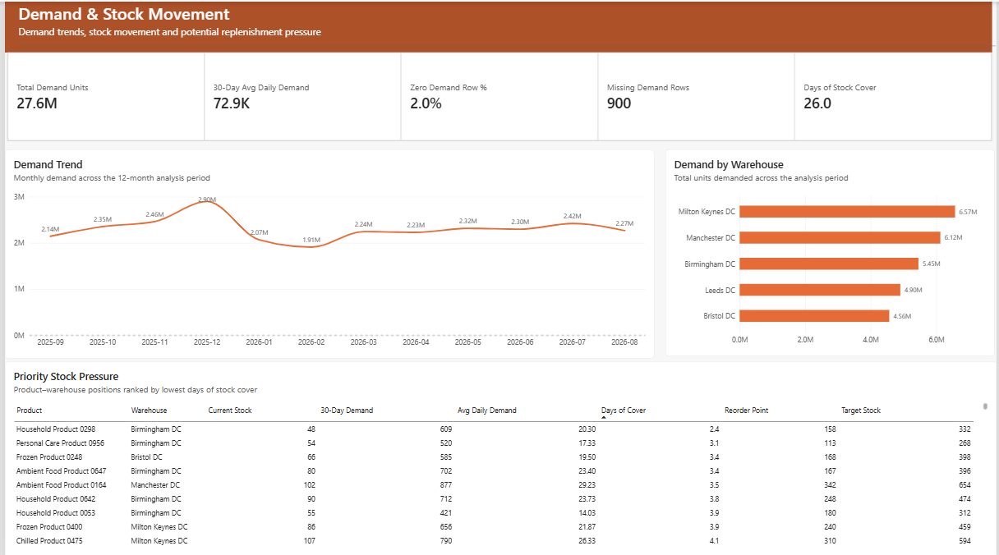
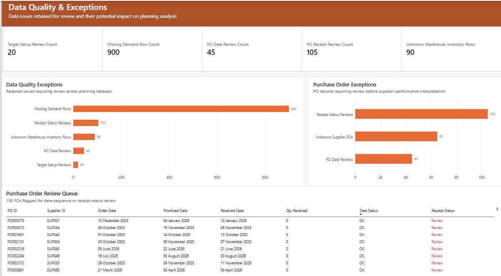

# Inventory & Stock Planning Analysis

## Project Overview

This project analyses inventory, supplier performance, demand and purchase-order quality to support stock planning and replenishment decisions across multiple warehouses.

The Power BI dashboard was designed to help operational and supply-chain stakeholders quickly identify:

- Stock positions below reorder or target levels
- Suppliers contributing most to late receipts
- Products and warehouses under stock-cover pressure
- Data-quality issues that could affect planning decisions

The project focuses on turning operational data into a prioritised decision-support tool rather than simply reporting headline metrics.

---

## Business Problem

Inventory planners need to maintain product availability without carrying unnecessary stock, while also accounting for supplier reliability and imperfect operational data.

The core business questions were:

- Where is stock currently below reorder or target levels?
- Which warehouses and products require the most urgent replenishment attention?
- Which suppliers are contributing most to late purchase-order receipts?
- Where is demand creating short-term stock pressure?
- Which data-quality issues need review before planning decisions are made?

The objective was to create a dashboard that helps stakeholders move from identifying an issue to understanding its cause and deciding what action should be prioritised.

---

## Executive Summary

The analysis identified several areas of operational risk across inventory, supplier performance and planning data.

Overall inventory stood at 1.9M units. Approximately 13.7% of product-warehouse positions were below reorder point, while 54.7% were below target stock levels, indicating a substantial gap between current inventory and planned stock positions.

Supplier performance presented an additional replenishment risk. Only 55.6% of timing-eligible purchase orders were received on time or early, with 22,810 late purchase orders recorded. Supplier-level analysis highlighted a group of suppliers contributing disproportionately to late receipts, providing clear targets for performance review.

Across the demand dataset, total demand reached 27.6M units, with a 30-day average daily demand of 72.9K units. Product-level stock-cover analysis identified several product-warehouse combinations with low days of cover and therefore higher short-term replenishment pressure.

Data-quality controls were retained throughout the analysis rather than removing problematic records. The final dashboard surfaced:

- **900** missing demand rows
- **105** purchase-order receipt-status reviews
- **45** purchase-order date reviews
- **90** unknown-warehouse inventory rows
- **20** stock-target setup reviews

Together, the four dashboard pages support three core stakeholder questions:

### What happened?

Identify stock, supplier and demand exceptions.

### Why did it happen?

Analyse warehouse, supplier and product-level drivers.

### What should we do?

Prioritise replenishment, supplier review and data-quality actions.

---

## Key Findings

### 1. Inventory Position

Current inventory totalled **1.9M units**, but the analysis showed a meaningful proportion of stock positions below planning thresholds.

- **13.7%** of product-warehouse positions were below reorder point.
- **54.7%** were below target stock levels.
- Several warehouse-product combinations showed sizeable gaps between current stock and reorder requirements.
- The exception view allows planners to focus first on combinations with the largest stock shortfalls.

This suggests the main issue is not overall stock volume alone, but how inventory is distributed across products and warehouses.

---

### 2. Supplier & Replenishment Performance

Supplier reliability was a significant source of replenishment risk.

- Only **55.6%** of timing-eligible purchase orders were received on time or early.
- **22,810 purchase orders** were classified as late.
- Supplier-level analysis showed that some suppliers contributed a larger share of late receipts relative to their overall PO volume.
- Average actual lead time also varied materially between suppliers.

This means supplier performance should be reviewed at supplier level rather than relying only on the overall on-time receipt rate.

---

### 3. Demand & Stock Pressure

Demand remained relatively stable across the analysed period, but stock-cover risk varied at product and warehouse level.

- Total demand was **27.6M units**.
- The latest 30-day average daily demand was **72.9K units**.
- Overall days of stock cover stood at **26.0 days**.
- Several product-warehouse combinations had materially lower cover than the overall position.

These lower-cover combinations represent the areas where continued demand could create near-term replenishment pressure.

---

### 4. Data Quality & Exceptions

Data-quality issues were retained and flagged instead of being removed from the analysis.

The final review queues identified:

- **900** missing demand rows
- **105** purchase-order receipt-status reviews
- **45** purchase-order date reviews
- **90** inventory rows linked to an unknown warehouse
- **20** stock-target setup reviews

Keeping these records visible provides greater transparency and allows operational teams to distinguish genuine business exceptions from issues caused by incomplete or inconsistent source data.

---

---

## Recommendations

| Priority | Recommendation | Owner | Expected Impact | Metric to Track |
|---|---|---|---|---|
| High | Prioritise replenishment for product-warehouse combinations below reorder point and with the lowest days of stock cover. | Inventory Planner | Reduce short-term stockout exposure and improve product availability. | % Below Reorder Point, Days of Stock Cover |
| High | Review suppliers contributing disproportionately to late purchase orders and agree corrective actions where performance is consistently below expectation. | Procurement / Supplier Manager | Improve inbound reliability and reduce replenishment uncertainty. | On-Time Receipt %, Late PO Count |
| Medium | Review product-warehouse combinations that remain below target stock despite acceptable overall inventory levels. | Inventory Planning Team | Improve stock allocation and reduce imbalances between locations. | % Below Target Stock, Stock Gap to Target |
| Medium | Investigate recurring low-cover products against recent demand to determine whether reorder parameters need adjustment. | Demand / Inventory Planner | Improve alignment between demand and replenishment settings. | Days of Stock Cover, 30-Day Avg Daily Demand |
| High | Resolve purchase-order date and receipt-status exceptions before using those records for supplier performance decisions. | Procurement Operations / Data Owner | Improve reliability of supplier and lead-time reporting. | PO Date Review Count, PO Receipt Review Count |
| Medium | Correct missing demand, unknown warehouse and stock-target setup records through the source-data process rather than removing them from reporting. | Data Owner / Operations Team | Improve data completeness while preserving transparency in planning decisions. | Missing Demand Rows, Unknown Warehouse Rows, Target Setup Reviews |

---

## Decision Framework

The dashboard is designed to support a simple operational decision process:

1. **Identify the exception**  
   Locate products, warehouses, suppliers or purchase orders outside expected thresholds.

2. **Understand the driver**  
   Compare stock position, demand, supplier performance and data-quality context.

3. **Prioritise action**  
   Focus first on exceptions with the greatest operational risk or planning impact.

4. **Assign ownership**  
   Route the issue to inventory planning, procurement or the relevant data owner.

5. **Monitor the outcome**  
   Track whether the selected KPI improves following corrective action.

---

## Dashboard

### Inventory & Stock Planning
Provides an overview of current inventory position, reorder risk, target-stock gaps and the highest-priority stock exceptions.



### Supplier & Replenishment
Tracks supplier delivery performance, late purchase orders, lead-time variation and suppliers contributing most to replenishment risk.



### Demand & Stock Movement
Shows demand trends, warehouse-level demand and product-warehouse combinations with the lowest stock cover.



### Data Quality & Exceptions
Surfaces records requiring review before they are relied upon for inventory, supplier or purchase-order decisions.



---

## Data Model & Methodology

### Data Model

The Power BI model was built using a star-schema approach to separate descriptive dimensions from transactional fact tables.

Core dimensions included:

- Products
- Suppliers
- Warehouses
- Date

Core fact tables included:

- Sales Demand
- Inventory Snapshots
- Purchase Orders
- Stock Targets

Relationships were configured as single-direction dimension-to-fact relationships to keep filter behaviour predictable and reduce ambiguity.

The Date dimension was actively linked to:

- Sales Demand `[date]`
- Inventory Snapshots `[snapshot_date]`
- Purchase Orders `[order_date]`

Additional inactive date relationships were retained for:

- Purchase Orders `[promised_date]`
- Purchase Orders `[received_date]`

This allowed alternative date analysis to be handled explicitly when required.

---

### Data Preparation

Power Query was used to profile, clean and standardise the source data before analysis.

Key preparation steps included:

- Standardising text fields and categorical values
- Mapping missing or blank supplier values to an explicit unknown category
- Retaining unknown warehouse records for review rather than silently removing them
- Flagging negative or invalid inventory records
- Identifying missing demand values
- Reviewing duplicate and missing purchase-order identifiers
- Flagging purchase orders with invalid date sequences
- Separating completed, open and review-required receipt records
- Identifying stock-target setup inconsistencies

The approach prioritised transparency by flagging questionable records rather than deleting them unless there was a clear analytical reason to exclude them.

---

### Analytical Measures

DAX measures were created to support inventory, supplier and demand decisions, including:

- Current Stock Units
- Below Reorder Point %
- Below Target Stock %
- Below Target Stock Count
- On-Time Receipt %
- Late Purchase Orders
- Average Actual Lead Time
- Timing-Eligible Purchase Orders
- Total Demand Units
- 30-Day Average Daily Demand
- Days of Stock Cover
- Missing Demand Row Count

Measures were grouped logically to keep the model maintainable and easier to audit.

---

### Validation

The report was validated before final sign-off through:

- KPI reconciliation against source-level totals
- Cross-filter and cross-highlight testing
- Review of sort order and exception prioritisation
- Filter and default-state checks
- Tooltip validation
- Navigation testing across all report pages
- Manual review of data-quality exception counts

This ensured the final dashboard was both analytically consistent and usable for operational decision-making.

---
---

## Tools Used

- **Power BI** — data modelling, DAX measures, dashboard design and interactive analysis
- **Power Query** — data profiling, cleaning, standardisation and exception flagging
- **DAX** — KPI calculations, stock-cover analysis, supplier performance measures and exception metrics
- **Excel / CSV** — source data inspection and validation
- **GitHub** — project documentation and portfolio presentation

---

## Limitations

This analysis is based on the available source data and defined planning rules, so several limitations should be considered when interpreting the results.

- Stock-cover calculations use recent demand behaviour and do not represent a formal demand forecast.
- Reorder and target-stock thresholds are treated as planning inputs rather than independently optimised values.
- Supplier performance is based on recorded purchase-order dates and receipt statuses, so unresolved source-data issues may affect individual supplier results.
- Missing demand, unknown warehouse and target-setup records were retained and flagged rather than removed, which preserves transparency but means some metrics should be interpreted alongside the data-quality page.
- The dashboard identifies operational exceptions and prioritisation opportunities but does not automatically calculate recommended order quantities.
- No cost, margin, service-level or holding-cost data was available, so stock risk is assessed primarily through inventory position, demand and replenishment performance.

---

## Potential Next Steps

Future development could extend the analysis by:

- Adding demand forecasting to estimate future stockout risk
- Calculating recommended order quantities using lead time, demand and safety-stock assumptions
- Adding inventory value and holding-cost measures
- Introducing supplier service-level targets and trend monitoring
- Automating source-data refresh and exception reporting
- Adding scenario analysis for changes in demand or supplier lead times

---

---

## Repository Structure

```text
inventory-stock-planning-power-bi/
│
├── README.md
│
├── images/
│   ├── 01_inventory_stock_planning.png
│   ├── 02_supplier_replenishment.png
│   ├── 03_demand_stock_movement.png
│   └── 04_data_quality_exceptions.png
│
├── data/
│   └── source CSV files
│
└── powerbi/
    └── inventory_stock_planning.pbix